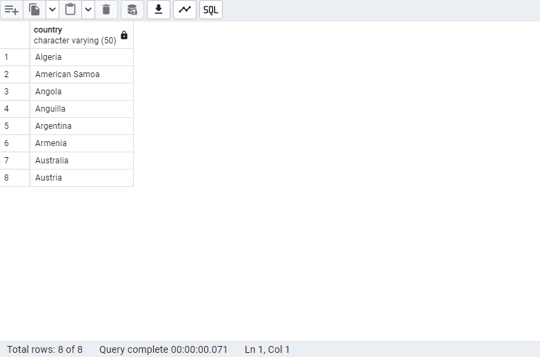
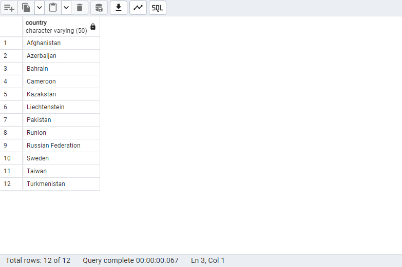
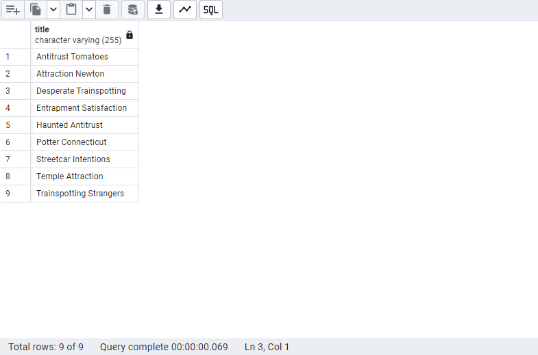
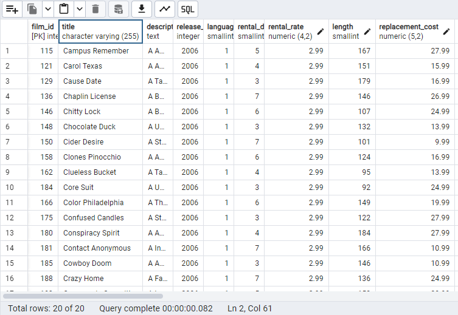

## 1. Retrieve all columns from the country table where the country names start with 'A' and end with 'a'.
### Query:
```sql
SELECT country FROM country
WHERE country LIKE 'A%a';
````

### Explanation:
This query retrieves all countries from the country table where the name starts with 'A' and ends with 'a'.

### Result:
 

## 2. Retrieve all columns from the country table where the country names have at least 6 characters and end with 'n'.
### Query:
```sql
SELECT country FROM country
WHERE LENGTH(country) >= 6 AND country LIKE '%n';
````
### Explanation:
This query retrieves countries from the country table where the name has at least 6 characters and ends with the letter 'n'. The LENGTH function ensures the minimum character count, and LIKE checks if the name ends with 'n'.
### Result:
 
 
## 3. Retrieve all columns from the film table where the title contains at least 4 occurrences of the letter 'T' (case-insensitive).
### Query:
```sql
SELECT title FROM film
WHERE LENGTH(title) - LENGTH(REPLACE(LOWER(title), 't', '')) >= 4;
````
### Explanation:
This query retrieves films from the film table where the title contains at least 4 occurrences of the letter 'T' (either uppercase or lowercase). The REPLACE function is used to remove the 'T' characters and the difference in length determines how many 'T's exist.

### Result:
 
 
## 4. Retrieve all columns from the film table where the title starts with 'C', length is greater than 90, and rental_rate is 2.99.
### Query:
````sql
SELECT * FROM film
WHERE title LIKE 'C%' AND length > 90 AND rental_rate = 2.99;
````
### Explanation:
This query retrieves all films from the film table where the title starts with the letter 'C', the film length is greater than 90 minutes, and the rental_rate is 2.99. The LIKE operator is used to match titles starting with 'C', while AND ensures all conditions are met.

### Result:
 
  
### Conclusion
These SQL queries demonstrate the use of the WHERE clause, LIKE, ILIKE, and other logical operators to filter specific records from the dvdrental and country databases. Each query utilizes string matching and character counting functions to achieve the desired results.